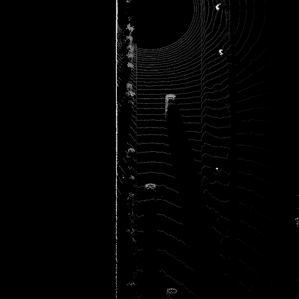

# Mid-Term Project
## 3D Object Detection
## 1.1- Visualize range image channels (ID_S1_EX1)
Task preparations

In file loop_over_dataset.py, set the attributes for code execution in the following way:

```python
data_filename = 'training_segment-1005081002024129653_5313_150_5333_150_with_camera_labels.tfrecord'
show_only_frames = [0, 1]
exec_data = []
exec_detection = []
exec_tracking = []
exec_visualization = ['show_range_image']
```
 
### 1.1- Results

## 1.2- Visualize lidar point-cloud (ID_S1_EX2)
Task preparations

In file loop_over_dataset.py, set the attributes for code execution in the following way:
```python
data_filename = 'training_segment-10963653239323173269_1924_000_1944_000_with_camera_labels.tfrecord'
show_only_frames = [0, 200]
exec_data = []
exec_detection = []
exec_tracking = []
exec_visualization = ['show_pcl']
```
### 1.2- Results


## 2.1- Convert sensor coordinates to BEV-map coordinates (ID_S2_EX1)
Task preparations

In file loop_over_dataset.py, set the attributes for code execution in the following way:

```python
data_filename = 'training_segment-1005081002024129653_5313_150_5333_150_with_camera_labels.tfrecord'
show_only_frames = [0, 1]
exec_data = ['pcl_from_rangeimage']
exec_detection = ['bev_from_pcl']
exec_tracking = []
exec_visualization = []
```
### 2.1- Results


## 2.2- Compute intensity layer of the BEV map (ID_S2_EX2)
Task preparations

In file loop_over_dataset.py, set the attributes for code execution in the following way:

```python
data_filename = 'training_segment-1005081002024129653_5313_150_5333_150_with_camera_labels.tfrecord'
show_only_frames = [0, 1]
exec_data = ['pcl_from_rangeimage']
exec_detection = ['bev_from_pcl']
exec_tracking = []
exec_visualization = []
```

### 2.2- Results


## 2.3- Compute height layer of the BEV map (ID_S2_EX3)

Task preparations

In file loop_over_dataset.py, set the attributes for code execution in the following way:
```python
data_filename = 'training_segment-1005081002024129653_5313_150_5333_150_with_camera_labels.tfrecord'
show_only_frames = [0, 1]
exec_data = ['pcl_from_rangeimage']
exec_detection = ['bev_from_pcl']
exec_tracking = []
exec_visualization = []
```
### 2.3- Results


## 3.1- Model-based Object Detection in BEV Image

Task preparations

In file loop_over_dataset.py, set the attributes for code execution in the following way:

```python
data_filename = 'training_segment-1005081002024129653_5313_150_5333_150_with_camera_labels.tfrecord'
show_only_frames = [50, 51]
exec_data = ['pcl_from_rangeimage', 'load_image']
exec_detection = ['bev_from_pcl', 'detect_objects']
exec_tracking = []
exec_visualization = ['show_objects_in_bev_labels_in_camera']
configs_det = det.load_configs(model_name="fpn_resnet")
```
### 3.1- Results


## 3.2- Extract 3D bounding boxes from model response (ID_S3_EX2)
Task preparations

In file loop_over_dataset.py, set the attributes for code execution in the following way:

```python
data_filename = 'training_segment-1005081002024129653_5313_150_5333_150_with_camera_labels.tfrecord'
show_only_frames = [50, 51]
exec_data = ['pcl_from_rangeimage', 'load_image']
exec_detection = ['bev_from_pcl', 'detect_objects']
exec_tracking = []
exec_visualization = ['show_objects_in_bev_labels_in_camera']
configs_det = det.load_configs(model_name="fpn_resnet")
```

### 3.2- Results


## 4.1- Compute intersection-over-union between labels and detections (ID_S4_EX1)

Task preparations

In file loop_over_dataset.py, set the attributes for code execution in the following way:
```python
data_filename = 'training_segment-1005081002024129653_5313_150_5333_150_with_camera_labels.tfrecord'
show_only_frames = [50, 51]
exec_data = ['pcl_from_rangeimage']
exec_detection = ['bev_from_pcl', 'detect_objects', 'validate_object_labels', 'measure_detection_performance']
exec_tracking = []
exec_visualization = ['show_detection_performance']
configs_det = det.load_configs(model_name="darknet")
```

## 4.2- Compute false-negatives and false-positives (ID_S4_EX2)

Task preparations

Please use the settings of the previous task.

## 4.3- Compute precision and recall (ID_S4_EX3)

Task preparations

In file loop_over_dataset.py, set the attributes for code execution in the following way:
```python
data_filename = 'training_segment-1005081002024129653_5313_150_5333_150_with_camera_labels.tfrecord'
show_only_frames = [50, 150]
exec_data = ['pcl_from_rangeimage']
exec_detection = ['bev_from_pcl', 'detect_objects', 'validate_object_labels', 'measure_detection_performance']
exec_tracking = []
exec_visualization = ['show_detection_performance']
configs_det = det.load_configs(model_name="darknet")
```

### 4.3- Results


To make sure that the code produces plausible results, the flag "configs_det.use_labels_as_objects" should be set to "True" in a second run. The resulting performance measures for this setting should be the following:

* precision = 1.0, recall = 1.0


